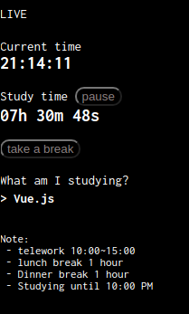
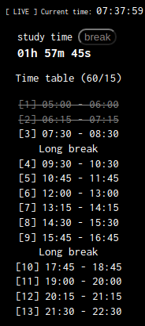
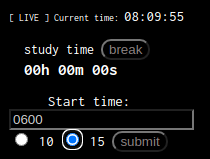
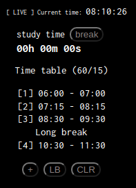

## Study With Me Time Tracker

I'm running a YouTube Study With Me [Channel](https://www.youtube.com/channel/UC8hY3wjYlK2U9W4fqKN598Q) and I made a simple time tracker with Vue.js.

### Version 1 (timetable1)

### Version 2 (timetable2)

### Version 3 (timetable3)

Set your start time and the interval/break-time per session.

Then, press `+` to add a period, `LB` to add a long break, or `CLR` to clear the table.

